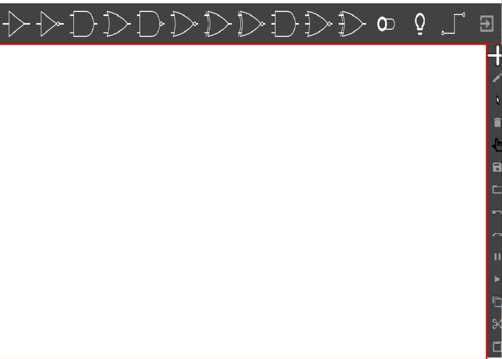
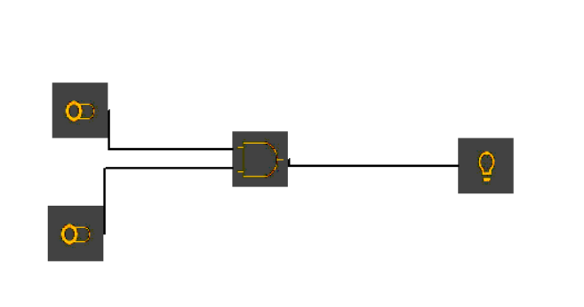
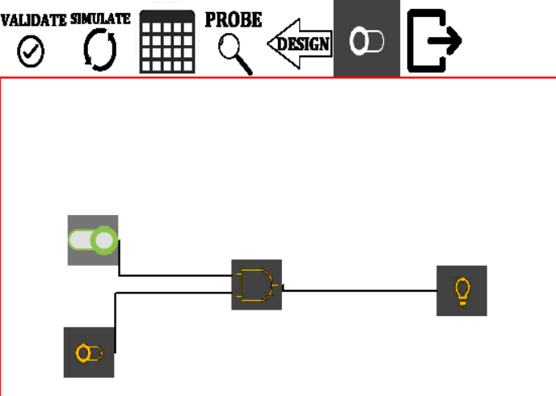
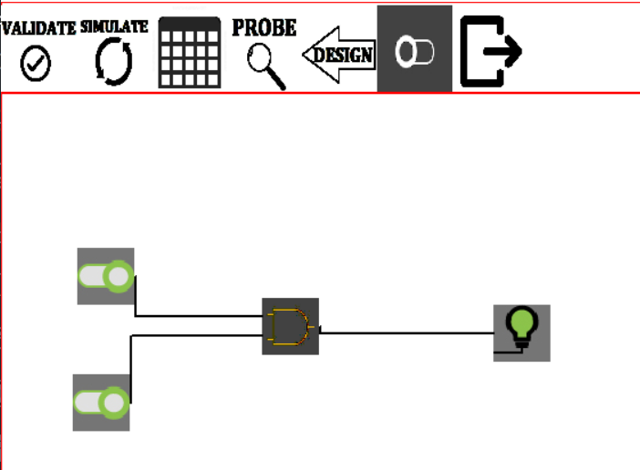

<p align="center">

</p>  


**Logic simulation is the use of simulation software to predict the behavior of digital circuits and hardware description languages.**

***Dependencies***
 - C++
 - C
 - Visual Studio
 

 #### Main Operations
  - Application supports two modes of operation:
    - Design Mode 
    - Simulation Mode
  
  ***Design Mode***
  - Add
  - Connect
  - Label
  - Edit
  - Select/Unselect
  - Delete
  - Move
  - Save
  - Load
  - Copy-Cut-Paste
  - Multiple Selection
  - Switch to simulaiton mode
  - Exit
  
  ***Simulation Mode***
  - Circuit Validation
  - Simulate circuit
  - Create Truth Table
  - Circuit Probing
  - Switch back to Design Mode

 ***Hierarchical Classes***

 
 
 
 
 
 
## Getting Started <a name="get-started"></a>
> This is an list of needed instructions to set up your project locally, to get a local copy up and running follow these
> instructions.

## Installing
 1. ***Clone The Project***
 ```
 https://github.com/ZiadSheriif/Logic-Circuit-Simulator
 ```
 2. ***Run Program***
 - Choose .sln file
 - Then open and click Ctrl+F5

## Screen Shots
<p align="center">

- Start-up page
  
  

- Using components with connection
  
  - One Switch
  
  

  - Two Switches 
  
  

- Simulate mode
  
  - On one switch   
  
  

  - On two switches
  
  

</p>
  <!--  -->
  

 
 


# Contributors

<table>
  <tr>
   <td align="center">
    <a href="https://github.com/ZiadSheriif" target="_black">
    
    <br />
    <sub><b>Ziad Sherif</b></sub></a>
    </td>
    <td align="center">
    <a href="https://github.com/ZeyadTarekk" target="_black">
    
    <br />
    <sub><b>Zeyad Tarek</b></sub></a>
    </td>
    <td align="center">
    <a href="https://github.com/Abd-ELrahmanHamza" target="_black">
    
    <br />
    <sub><b>Abdelrahman Mohamed</b></sub></a>
    </td>
    </td>
     <td align="center">
    <a href="https://github.com/SarahElzayat"target="_black">
    
    <br />
    <sub><b>Sarah Elzayat</b></sub></a>
    </td>
   
    
    
  </tr>
 </table>

# License

> This software is licensed under MIT License, See [License](https://github.com/ZiadSheriif/Logic-Circuit-Simulator/blob/master/LICENSE) for more information ©ZiadSherif.